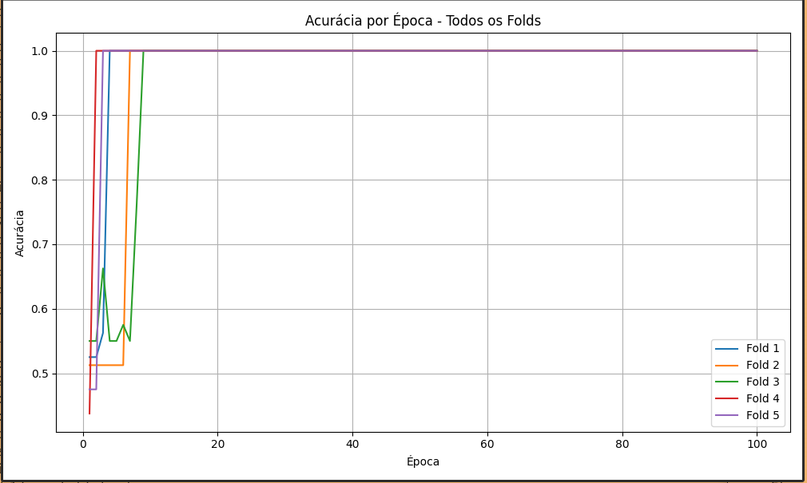

# Perceptron
this repository is dedicated to activity for intellligence systems in the course mecthronic's engeenring

## link do relatorio
[link](https://www.overleaf.com/read/pvqtpgntjwnd#1f4bcc)
## Parametros do perceptron
## Pesos e Viés (Inicialização)
Como são definidos inicialmente?

Geralmente, os pesos e o viés são inicializados com valores aleatórios pequenos (ex: entre -1 e 1).

    Isso porque o perceptron aprende os valores corretos durante o treinamento.
2. Taxa de Aprendizado (Learning Rate, η)
Como escolher?
A taxa de aprendizado controla o quanto os pesos são ajustados a cada erro.
Comece com η = 0.01 e vá testando. Se não estiver aprendendo, aumente. Se estiver oscilando, diminua.

## Dataset
the link of dataset is here [text](https://c3.ndc.nasa.gov/dashlink/projects/42/resources/?type=ds)

Implementação do Perceptron
Esta especificação trata da implementação do Perceptron. A linguagem de implementação é c.
Independentemente da linguagem de programação que você adote para a realização do seu trabalho, seu
código deve ser minimamente documentado.
Você deve produzir um relatório de até 2 páginas descrevendo os experimentos computacionais que realizou

para testar sua implementação. Sua descrição deve compreender a base de dados que foi utilizada, os parâmetros testados e configurações de rede. Idealmente você deve apresentar gráficos que demonstrem o comportamento do erro durante as épocas de treinamento e dos resultados de teste obtidos. Caso mais de uma configuração de parâmetros seja utilizada, você pode comparar as abordagens. O relatório deve ser
produzido de acordo com o formato de artigos de conferência da IEEE, disponível aqui:
https://www.ieee.org/conferences/publishing/templates.html. Sugere-se o uso de LaTeX para produção do relatório, muito embora você não seja penalizado caso use o template no formato Word/Doc. Você deve citar em seu relatório as referências utilizadas no desenvolvimento do seu trabalho. Caso haja suspeita de uso de códigos prontos encontrados em sites/blogs de internet você será convidado a uma avaliação
síncrona/online onde será arguido do seu código (por favor, não usem ChatGPT e similares). Caso você decida não fazer a avaliação ou não consiga explicar detalhes do código sua nota será zero. Além das implementações e do relatório, você deverá entregar um vídeo de até 5 minutos (vídeos com mais de 5 minutos não serão avaliados) contendo uma apresentação (slides) do seu trabalho. Relate a implementação de forma breve, mas tenha em mente que o foco da apresentação deve ser nos experimentos
que você realizou para o seu trabalho

Você deve implementar uma rede Perceptron, de uma única camada, para problemas de classificação binária
(isto é, duas classes). Seu projeto deve conter, no mínimo, as bases de dados que foram utilizadas por você
nos experimentos; funções que permitam o treinamento e a aplicação de uma rede já treinada. Você pode
implementar mais funções (para plots, etc) caso ache necessário. Você deve realizar experimentações com
pelo menos uma base de dados linearmente separável (sintética, gerada por você) e uma base de dados não
linearmente separável (você pode gerar ou usar uma base de dados pronta). Cite bases e suas fontes.
A implementação deve tratar casos 2D e de múltiplas dimensões. Recomenda-se testar o código em pelo
menos uma base multidimensional do UCI (https://archive.ics.uci.edu/). Avalie seu código usando métricas e
estimadores apropriados, conforme visto em sala. Para esta parte, você pode usar bibliotecas prontas, como
por exemplo o SciKit Learn do Python. A implementação do Perceptron em si, deve ser sua.
O que você deve avaliar para seu relatório? Principalmente qual o desempenho de sua implementação (em
termos de resultados de classificação obtidos, não em termos de tempo computacional) e de diferentes
configurações de rede no problema que você escolheu abordar. Reporte de forma detalhada qual forma de
validação do modelo você usou (validação cruzada? hold out? treinou e testou nos mesmos dados?) e quais
métricas de avaliação você empregou. As decisões adotadas serão critério para avaliação do seu trabalho

### Saida do programa atual
#### Dados Lineares

#### Dados Não Lineares

